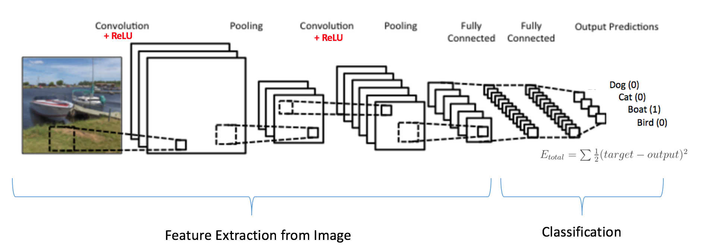

This blog aims to discuss the intuitive thinking behind getting a neural network to perform a task for us, specifically the Neural Style Transfer **(NST)**. No code will be discussed and in fact to make it a fun read to every reader, it also assumes none to minimum knowledge of neural network.

In case you are wondering what is this catchy phrase 'neural style transfer', let me tell you about it. It's basically taking two images and making the first image appear as if painted with second image's style.

To make it much clearer, here's my best friend [Ana de Armas](https://www.google.com/search?q=ana+de+armas) explaining to you:

Before we begin, as per the tradition, let's quickly read and ignore the history.

#### Once upon a time...

---

Initially to achieve this mixing of style, the procedure followed was as follows:

* Collect many images, say A, and their already styled photo, say A'.

* Somehow learn the transformation from getting A → A'.

* Given a new image B, use it to generate B' using the transformation learnt from A → A'.

The major drawback of this method was the difficulty in collecting pairs of A and A' for learning and also the difficulty in learning such a transformation which could be applied on other images (B). This was one of the major hurdles faced during that time and it seemed that without a breakthrough technique, which solved these issues, any realistic progress could not be acheived.

#### The Breakthrough

---

[Leon Gatys](https://scholar.google.co.in/citations?user=ADMVEmsAAAAJ&hl=en), [Alexander Ecker](https://scholar.google.co.in/citations?user=VgYU_m8AAAAJ&hl=en) And [Matthias Bethge](https://scholar.google.com/citations?user=0z0fNxUAAAAJ&hl=en) introduced NST in their paper ["A Neural Algorithm of Artistic Style"](https://arxiv.org/abs/1508.06576) published in the year 2015. It not only solved the above problems but paved way to many modifications/alterations on this technique that were able to achieve real time generation of the styled image.

#### Why NST is remarkable

---

As with other developments in deep neural network world, this introduced a different view to the problem. It discussed about the representation of the content from the first image (content image) and the appearance of the second image (style image) and how to combine them using deep neural network to get the desired output.

### Here we go...

The deep neural networks are made of multiple layers of something called 'neurons' (see [this blog](https://joyterencebarnes.netlify.app/deep-learning-neurons/)) which can be pictured as follows.

As you can see, first layer interacts with the image directly. The following layers take input from the output of layer before it. We know that neural networks 'learn' something about the image and also, it has been observed that the initial layers learn to detect simple stuff about the images. It could be a simple straight line, circle... The layers above it could get these lines, circle as inpus and detect something more meaningful like an eye structure, lip structure and so on. The layers above this could use this eye, lip.. and detect the entire face. Or in other words, as you progress across the layers, the networks is able to see a bigger 'picture' (pun intended) of the input image.

With this making sense, it makes it easier to explain the idea behind the paper.

Quickly let me restate the problem in different words, we need some way to get the **'structure'** of the first image and paint it with the **'style'** of the second image and combine these two for the new image with structure of first and style of second.

So the next obvious questions are how to get this **structure** and **style**.

For this we need a neural network that has seen enough images in its life (trained with million of images). The one that they used in the paper is called VGG19, which is also the one shown in the above image. What a coincidence! totally unexpected!!

Now we know from just a while ago, that later layers of a neural network learns the bigger 'picture'. So by feeding the neural network with our Ana de Armas picture, those later layers will probably learn about the outline of her body features. So we can just feed this image and extract **not the final output but from the later layers in between**.

We now have the **structure** of the first image quite easily.

Now comes the tricker part, to extract the **style** of the second image.

For this, we need to understand a bit more about what actually happens at the layer of a neural network.

For every layer a matrix, called as kernal or filter, is applied on to the image as shown above. What this filter looks for is entirely random. It could be assumed as a straight line, stroke of a particular color and so on. When it gets whatever it is looking for, it puts a bigger number on the corresponding box of the output image. Read this again by looking at the animation above.

And every layer is applied with a number of such filters, so if we feed in a single 10 * 10 image to a layer which applies 5 different filters as above we will get 5 such 10 * 10 output (let's not worry about strides and padding in the kernel for now). Again refer the image below to get a fair understanding.

The second stage above has 3 rectangles because the input image was operated on by 3 filters as was shown in the animation above.

So now we _kinda_ know what happens to a layer in a (Convolutional) neural network. Let's get to the problem of extracting the **style** from the second image.

Recollect that neural network sees the 'bigger' picture in the later layers. But the style from the image is more related to those minute things like stroke of brush, the simple random patterns. So it is now obvious that we should take the input from first few layers of neural network as we want the 'smaller' picture of the image. So we now know we need something from earlier layers to get the **style**. 

So we now again feed the second image to the VGG19 Neural network and cherry pick the output from the first few layers, like for example the first 3
rectangles from the above image. Inspite of understanding that these layers now have the details about minor things of the second image, we need only those details that has been common among all these outputs(or 3 boxes). How do we find the common things that is present in these 3 boxes? Maths comes to the rescue. The research paper suggests about using 'Gram matrices' of these 3 boxes. (Won't go in detail as to what exactly this is, but it is enough for the scope of this blog to accept that this somehow fetches only the common details present in all the 3 boxes).

Now we know what is and how to fetch content from the first image and style from the second image. 
But the question still remains how to generate the combined image!!

From now on, things get pretty straightforward.

For output image, we make use of a random image initialized with garbage values. We feed it across the same neural network and extract the **style** from the earlier layers and **content** from later layers. 

And then we compare the difference between the content obtained from this random image to the content obtained from the first image. Also, we simulatenously compare the difference between the style obtained from this random image to the style obtained from the second image.

Mathematically we call this difference, in neural network terms, a ***loss***.

So,

$$
L_c = C_i - C_o 
$$

$$
L_s = S_i - S_o 
$$

$$
T_l = L_c + L_s
$$

(where L is loss, c is content, s is style, i is input-image, o is output-image and T is total)

