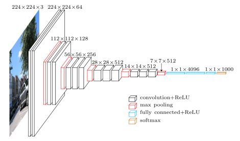

This blog aims to discuss the intuitive thinking behind getting a neural network to perform a task for us, specifically the Neural Style Transfer **(NST)**. No code will be discussed and in fact to make it a fun read to every reader, it also assumes none to minimum knowledge of neural network.

In case you are wondering what is this catchy phrase 'neural style transfer', let me tell you about it. It's basically taking two images and making the first image appear as if painted with second image's style.

To make it much clearer, here's my best friend [Ana de Armas](https://www.google.com/search?q=ana+de+armas) explaining to you:

Before we begin, as per tradition, let's quickly read and ignore the history.

#### Once upon a time

---

Initially to achieve this mixing of style, the procedure followed was as follows:

* Collect many images, say A, and their already styled photo, say A'.

* Somehow learn the transformation from getting A → A'.

* Given a new image B, use it to generate B' using the transformation learnt from A → A'.

The major drawback of this method was the difficulty in collecting pairs of A and A' for learning and also the difficulty in learning such a transformation which could be applied on other images (B). This was one of the major hurdles faced during that time and it seemed that without a breakthrough technique, which solved these issues, any realistic progress could not be achieved.

#### The Breakthrough

---

[Leon Gatys](https://scholar.google.co.in/citations?user=ADMVEmsAAAAJ&hl=en), [Alexander Ecker](https://scholar.google.co.in/citations?user=VgYU_m8AAAAJ&hl=en) And [Matthias Bethge](https://scholar.google.com/citations?user=0z0fNxUAAAAJ&hl=en) introduced NST in their paper ["A Neural Algorithm of Artistic Style"](https://arxiv.org/abs/1508.06576) published in the year 2015. It not only solved the above problems but paved way to many modifications/alterations on this technique that were able to achieve real time generation of the styled image.

#### Why NST is remarkable

---

As with other developments in deep neural network world, this introduced a different view to the problem. It made use of two terms:

* Content Image: the 'structure' or the representation of the content of the first image.

* Style Image: the 'appearance' or style of the second image.

The paper discussed about how to use the above to create a new third image that has content of first and style of second. It leveraged the processing of information that travelled across the layers of neural network. Or in other words, it took advantage of what a neural network saw in the two input images to generate the mixed output image. Let's see how and what exactly it achieved. But before that, a bit about what neural networks are and what do they _see_ when we give an image as input.

### Here we go

The deep neural networks are made of multiple layers of something called 'neurons' (see [this blog](https://joyterencebarnes.netlify.app/deep-learning-neurons/) for a quick idea about it). The entire network can be pictured as follows.

As you can see, 1^st^ layer interacts with the image directly. The 2^nd^ layer takes output of this 1^st^ layer as its input, 3^rd^ layer from 2^nd^ and so on. We know that neural networks 'learn' something about the image and also, it has been observed that the initial layers learn to detect simple stuff about the images. It could be a simple straight line, circle... The layers above it could get these lines, circle as input and detect something more meaningful like an eye structure, lip structure and so on (if input image was human face). The layers above this could use this eye and lip and detect the entire face.

In short, as you progress across the layers, the networks is able to see a bigger 'picture' (pun intended) of the input image.

**NOTE**:

_I have told that neural networks learn about structure of eyes and so on from human image. But this is not true always. Truth is that a neural network behaves like a blackbox. We never know what it will learn, but after running it against thousands of images, it is safe to assume that neural network learns such 'bigger' picture in its own way for now._

With this making sense, it makes it easier to explain the idea behind the paper.

Quickly let me restate the problem in different words, we need some way to get the **'structure'** of the first image and paint it with the **'style'** of the second image and combine these two for the new image with structure of first and style of second.

So the next obvious questions are how to get this **structure** and **style**.

For this we need a neural network that has seen enough images in its life (trained with million of images). The one that they used in the paper is called VGG19, which is also the one shown in the above image. What a coincidence! totally unexpected!!

We also know from just a while ago, that later layers of a neural network learns the bigger 'picture'. So by feeding the neural network with our Ana de Armas picture, those later layers will probably learn about the outline of her body features. We need these features as it is what we want for the output image. To obtain these features, we can just feed this image as input to VGG19 neural network and extract **not the final layers output but from the few layers before it**.

We now have the **structure** of the first image quite easily.

Now comes the tricker part, to extract the **style** of the second image.

For this, we need to understand a bit more about what actually happens at the layer of a neural network.

For every layer in the neural network, a matrix called as kernal or filter is applied on to the image as shown above. What this kernal looks for is entirely random. It could be assumed as a straight line, stroke of a particular color and so on. When it gets whatever it is looking for, it puts a bigger number on the corresponding box of the output matrix. This matrix is the input to the next layer. Read this again by looking at the animation above.

And every layer is applied with a number of such filters, so if we feed in a single 10 \* 10 image to a layer which applies 5 different filters as above we will get 5 such 10 \* 10 output (let's not worry about strides and padding in the kernel for now). Again refer the image below to get a fair understanding.

The second stage above has 3 rectangles because the input image was operated on by 3 filters as was shown in the earlier animation.

So now we _kinda_ know what happens to a layer in a neural network aka Convolutional Neural Network. Let's get back to the problem of extracting the **style** from the second image.

Recollect that neural network sees the 'bigger' picture in the later layers. But the style from the image is more related to those minute things like stroke of brush, the simple random patterns. So it becomes obvious that we should take the input from first few layers of neural network as we want the 'smaller' picture of the image. We need to fetch this information from earlier layers to get the **style**.

We again feed the second image to the VGG19 Neural network and only pick the output from the first few layers, like for example the first 3
rectangles from the above image. However we don't need every information from these 3 layer outputs, we need only things that are common across them. But how do we find the common things that is present in these 3 layers? Maths comes to the rescue. The research paper suggests using 'Gram matrices' of these 3 output layers. (Won't go in detail as to what exactly this is, but it is enough for the scope of this blog to accept that this somehow fetches only the common details present in all the 3 layers). After performing this 'gram matrix' operation on the 3 layers, we will get the **style** of the image.

Now we know what is the content from the first image and style from the second image and also how to fetch them.
But the question still remains how to generate the combined image!!

Since you have been with me till here, let me tell you that things get pretty straightforward from here onwards.

To generate the output image, we make use of a new random image which is initially initialized with garbage values. We feed it across the same neural network and extract its **style** from the earlier layers and its **content** from later layers.

And then we compare the difference between the content obtained from this random image to the content obtained from the first image. Also, we simulatenously compare the difference between the style obtained from this random image to the style obtained from the second image.

Mathematically we call this difference, in neural network terms, a ***loss***.

So,

$$
L_c = C_i - C_o
$$

$$
L_s = S_i - S_o
$$

$$
T_l = L_c + L_s
$$

(where L is loss, c is content, s is style, i is input-image, o is output-image and T is total)

Now using this loss function we try to slightly modify the values of the random image ( achieved by praying to calculus and getting its blessing ). Then again feed this slightly modified image into VGG19, again extract the content and the style, again compare it with the original content image and style image, calculate the extent of their difference from the loss function and use this loss to slightly modify the random image. We repeat the process until we cannot reduce the loss anymore. I agree that this is a lengthy and repetitive process, but as long as the computer does not complain we can make it to work as much as we want.

When the loss does not reduce anymore, it indicates that our random image has evolved into the desired output image having the content very close to that of first input image and style very close to that of second input image. The next steps are straightforward too. You either build an app like prisma or write a blog 😃.

#### Final remarks

---

We were lagging behind in tasks like generating artistic artefacts having high perceptual quality until recent time. The advancement of computing power, viz. GPUs and the state of the art deep learning techniques being invented everyday such as NST has opened up a plethora of opportunities and possibilities.

Even though these techniques might be quite complex at the first glance, they all have one thing in common. Their foundation is often backed by a simple intuitive thinking. Above this foundation, there could be various clever tactics employed either in the math or in the code. For example, with respect to the above NST, we could reduce the time and processing by avoiding a third image but instead reuse the first image itself as the output image. This is infact the approach used by one of the papers to achieve real time style transfer. That's a discussion for some other time. 🍺

[Github Link](https://github.com/JoyTerence/Style-Transfer)
