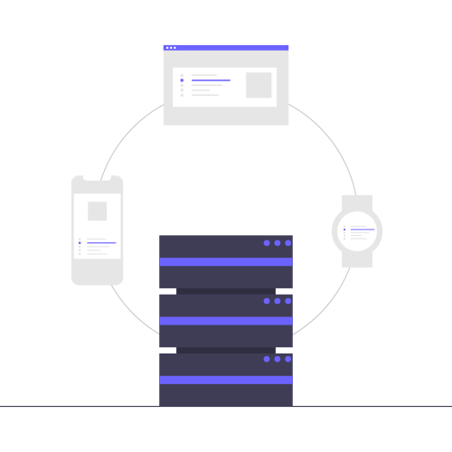

#### What is this SPA

---

Its just a fancy word for a website that doesn't reload fully whenever you click on something. That is the website is technically made of just a single page and is composed of dynamically updating pieces usually as a response to an user action. Infact this site itself is an SPA!

Even if you aren't eager, let me tell you how I built my first ever SPA:

- Google what is SPA and what ingredients are required a prepare the next best SPA.

- Choose React because I got tired of going through numerous React vs Vue, Vue vs Angular, React vs Flutter arguments...

- Realized that I need a server to fetch some content to display in the website, but was too lazy to write one

- Thanked Google overlords and their disciples for creating firebase and all the copy paste code available in stack overflow.

- Click buttons on a free hosting site blindly just like reading terms and conditions and viola.. my SPA was ready to be served!

This worked as long as my site was a simple and I didn't have to worry about things such as:

1. how to engage more users,
2. how to scale when users increased,
3. how to not get frustrated with firebase for not, magically, solving every issue I faced.

Eventually I had to get my hands dirty, time had come to build my own backend.


Just an additional note, recently I was introduced to this really great framework [fastify.io](https://www.fastify.io/) by [noobjeevan](https://twitter.com/noobjeevan). The reason why I immediately started liking it is its powerful, lightweight plugin inspired architecture while giving this amazing speed as its name indicates.

So coming back, once I was done with my first version of backend support, I wanted to deploy it and run alongside my website. Now there were few options to do this.

##### 1. Serve the bundle via backend

---

I can make my entire website, react bundle, as the first thing to be sent to browser when the user queries for my domain.

Say I bought a domain <http://nexttrendingsite.com/> and configured it to point to my server, when user enters this URL then my backend will first send the website bundle (html, css, javascript in all its glory) to the browser. Then in the browser, whenever user performs any action, my website will forward all the requests to display the content to <http://nexttrendingsite.com/api/v1/...>, which would be my API endpoint on the server.

This seemed a plausible one, but I wanted to keep my frontend and backend separately and I wasn't entirely comfortable with such a coupling (I blame micro-services for this). So I started looking for some other ways.

##### 2. Reverse proxy

---

Yes, I could have taken the API gateway approach and achieved my goal. But  honestly it felt like a overkill for my little project and not to mention it comes with additional cost and maintainance. There was a much simpler way to achieve this.

In comes, reverse proxy. Most libraries like React, Vue, have support for proxying requests to backend server. _Note: In react the proxy support is available only in development environment._

In production, something like nginx could be used to proxy requests to backend server.
So, say we have two different domains:

- <http://nexttrendingsite.com/> to load/serve our website.

- <http://api.nexttrendingsite.com/> is where our Backend server listens for API requests.

A simple nginx configuration as follows will direct all api calls to the backend.

```config
http{
    // upstream host
    upstream api {
        server api.nexttrendingsite.com:8080
    }

    // website host
    server {
        listen 80
        server_name nexttrendingsite.com

        # proxy all requests to upstream host
        location /api {
            proxy_pass http://api
        }

        # serve static files for everything else
        location / {
            try_files $uri $uri/ /index.html
        }
    }
}
```

The beauty of this approach is that this allows me to bypass CORS implementation as from browser perspective it is still requesting the same domain for serving website as well as API end point.

##### 3. CORS way

---

This approach seems a bit controversial to me, especially so far, I've not found a winning argument in the CORs proponents and opposers. Some say that CORS is just a terrible way of bypassing security, whereas I found some passionately say that it should be embraced and utilized.

A quick brief on what is CORS, it is mechanism where a server tells brower whether to honor or not to honor the requests for its resources from any other server. That is, say you open www.server1.com in your browser and suppose part of that website needs to display image from www.server2.com, then server2 can inform browser to fetch or not to fetch such a resource from www.server1.com. This is achieved with CORS by means of certain HTTP headers.

So, coming back to my SPA, I could just host my website at <http://frontend.com> and host my backend server at <http://backend.com> and now in backend server, I can enable CORS and configure it such a way that it only requests from its own domain or <http://frontend.com>. I had a good time learning while trying to follow its principles, especially the caveats that comes with CORS.

If you remember, I said that say CORS is just terrible way of bypassing security and some were vocal about strengths of CORS, so let me share some of those arguments that I came across...

First, those against CORS were,

1. CORS needs an additional preflight request to the server to confirm that the server supports CORS or permits the subsequent actual CORS request or not. This means for every single request of resource, browser has to perform two requests. This can affect performance.
2. Caching the preflight requests on the browser isn't a solution if a request is made towards variable resource, since cache also works at the URL level and not just at domain level. So scaling isn't possible if the SPA makes thousands of requests in a short time against variable resources.
3. CORS if wrongly implemented, can easily become a knight with whole lot of chinks in the armour.

For arguments were,

1. CORS is aimed at protecting users, because server1 can directly still go ahead and request server2 for its resources. So if implemented properly, CORS is really a good way to ensure that communication between your frontend and backend is secure.
2. Caching the preflight requests on the browser does help with performance a little(though countered by the second point above). Also, the caching can be done on the server side as well.
3. For those that cannot afford maintenance and additional cost that comes with setting up an API gateway or loadbalancers and quickly want SPA to be served from a domain different from others, then CORS is a good option provided that they are aware of what they are doing.
4. CORS preflight doesn't happen for every request, only those requests which contain HTTP headers that are not marked as CORS-safelisted request header.

So there you go, after few days of analysizing deeply these arguments, I came to the conclusion that I am broke and really not interested in trying to configure a load balancer, so I decided to learn CORS and have some fun with it. As it turns out, it was a fun experience, until I realised my idea was not really the next big thing and I brought it all down the next day 😃.
