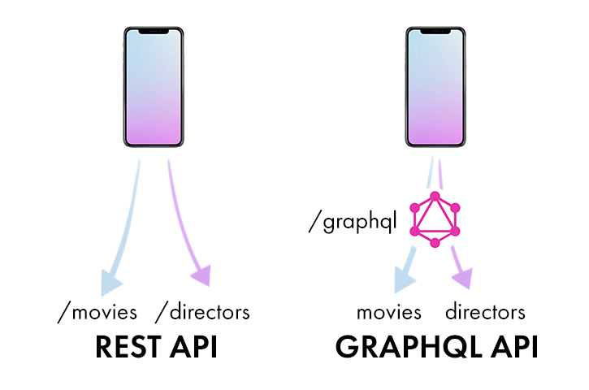

Qraphql is one of the exciting technologies that heavily utilizes graph based relationships between data and provides a  powerful means of querying and manipulating it.

---

Traditionally REST APIs are used for quite some time now to fetch data from a server to a client. Due to its stateless nature and clear advantages over SOAP, it was readily adopted and used by the community. However, as with anything REST has few flaws. The URL based fetching of resources places an significant burden to remember the multiple endpoints. The other problem is rather a basic one, the `REST fails to provide the client with only the required data`.


With GraphQL, you model your business domain as a graph. 

In the server, this is achieved by defining schemas. Here we define different data and their types and relations. 

```graphql
type Character {
  name: String!
}

type Query {
  hero: Character
}
```

The client can then query for this data as follows in a format similar to json, 

```graphql
query {
    hero {
        name
    }
}
```
***Note: the Object-Oriented relationship between the data queried***


