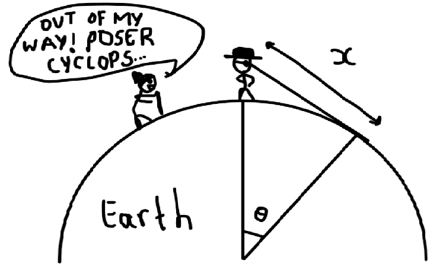
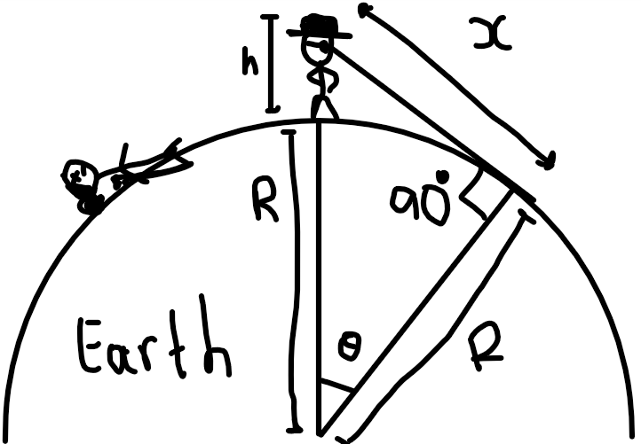
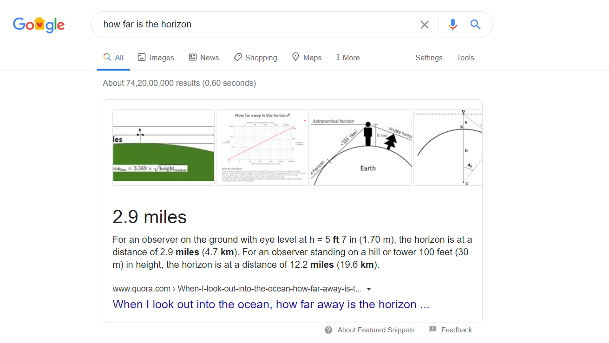

We all have looked out the windows or have stood out in the open, immersing ourselves in the deep thoughts. The temporary period of time where you seem to have absolute command over your language while conversing with yourself. Fixing your gaze on the horizon, lost in your thoughts, while being the annoying hinderance to the random stranger out on his regular walks.

But have you ever thought this... how far is the horizon from you? How far is that line, the line about which numerous poets have penned their poems.

Anyways, I had this thought  and it resulted in a strong craving to calculate an approximate value of it by myself without looking it up on the net. So it started.

For reasons unknown, I thought trignometry looks cool to solve this and find my 'x' 😃. It was time for me to put up my thinking cap and act like I was solving the string theory. Well, no matter what equations I came up with in haste, the 'x' was never happy and didn't want me to find it. It ended up being a messy affair.

That is when it dawned to me, why did I not think of using the Pythagorean theorem.

Since the line of sight is tangential to the earth at the horizon, we are left with a right angled triangle ready to be applied with pythagorean equation.

Quick elementary maths:

$$
(h+R)^2 = R^2+x^2
$$

$$
h^2 + 2hR + R^2 = R^2 + x^2
$$

$$
x^2 = h^2 + 2hR
$$

$$
x = sqrt(h^2 + 2hR)
$$

Given that I know my height ~1.8m = 0.0018km and Radius of earth, R = 6378.1km

$$
x = sqrt(0.0018^2 + 2 * 0.0018 * 6378.1)
$$

$$
x = sqrt(22.9611)
$$

$$
x ≈ 4.79 ≈ 5km.
$$

So there you go, for a person of height of approx 6ft(1.8m) the farthest you can see in an open region with no obstacle in the line of sight to the horizon is 5kms.

Guess what? even google tells me the same thing! 

Now I can finally sleep in peace.
