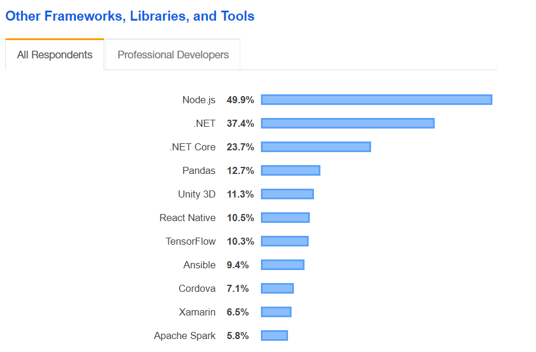

Though native app development is more preferred to create apps in both Android and iOS, there has been a steady increase in the interest for building cross-platform mobile apps. Two of the popular frameworks used for cross-platform development are [React Native](https://facebook.github.io/react-native/) and [Flutter](https://flutter.dev/).

####React Native
--- 
React Native was introduced by Facebook in 2015. It boasts of combining best parts of native development with React and Javascript. Their motto is **"Learn once, write anywhere"**. You only need to write a Javascript code once, then the react native takes care of making it compatible with both iOS and Android.

React Native makes use of the native UI building blocks for rendering, which is advantageous because it not only gives a native UI feel in the apps but also can be reused for different platforms as long as there is some way to convert the React code into Native UI. This job of converting React Native code and UI to system calls and native UI elements is done by Javascript Bridge that sits between ReactNative code and Native elements. 

__Development Experience__

When I started learning React Native, around 2017, my knowledge of React came very handy. The [documentation](https://facebook.github.io/react-native/docs/getting-started) provided by the facebook is fairly easy to understand for a beginner. But however getting the development setup up and running was a real frustrating experience. I spent almost a month in getting the react native installed and working without any errors. I found many people who had faced such errors and often the solutions which worked for them did not work for me. This obviously made me to take several breaks from learning the framework. 

However, I should admit that my exploration was more inclined towards Android platform and very limited towards the iOS platform. During the implementation of the app, I also faced numerous problems mainly due to lack of certain native platform features. This meant I had to either code the support by myself or to do a extensive github search for open source library that provided that support. Often such Github projects had conflicting library dependencies and I spent a good amount of my time solving those issues instead of spending it on planning and execution of my app. This became a painful recurring situation whenever there was a new open source library was required to be installed. 

But once the setup started working (A miracle!), the development seemed very smooth and quick. The hot reload feature made it very convienent to test out any subtle changes in the UI or in my app logic. Since my apps were not performance critical, the look and feel of the app was indistinguishable from the native platform. Other than the dependency issues, I felt that I could underlying logic and initial UI fairly quickly.

The declarative syntax from react made me feel it to be really easy and intuitive to code. Since the community is large and active enough, I could google my problems and get an idea about what is going wrong, if not solve the issue.

__Industry__
***
Due to the backing by facebook, the react native has been popular among the developers. It was the top ranked framework in its kind, in the stackoverflow survey of 2019.

__Future__
***
React Native is being challenged by Google's Flutter. Though relatively new, Flutter seems to outperform React Native, mainly in the performance section. The proponents of Flutter stress on the significance of adoption of Dart by the framework. Unlike Javascript, which is known for being messy, Dart is quite easier to understand due to its similarity to Java.
The informative and easy to understand documentation provided by Google  also adds to the point under the Flutter column. Given the head start react native had, Flutter suffered from lack of support to various features. However, lately this support has been extended and it is not regarded as the achilles heel.

While there has been a increase in popularity for both the frameworks, the native development still wins the prize mainly due to its performance and feature availability. Companies, scared of missing the boat and attracted by the '_code once, use everywhere_', shifted their code base to react native and later realised that its disadvantages were significant enough to shift back to native development. Check this [post on Medium](https://medium.com/airbnb-engineering/react-native-at-airbnb-f95aa460be1c) about the the move to react native and back to native by Airbnb.

__Final thoughts__
***
I had a wonderful learning experience with react native. Personally, I feel it is a fun tool to learn. There has been a good amount of demand for react native developers at Bengaluru, where I'm currently residing. I believe eventually, we might have a framework that has addressed cross-platform mobile development frameworks issues and is identical to native development in all respects. I am planning to spend some time with Flutter, mainly due to being bombarded with Medium posts by its proponents 😅 and also to learn for the fun.

__Links to my react native apps__
***
 - [Github-Triage](https://github.com/JoyTerence/Github-Triage)
